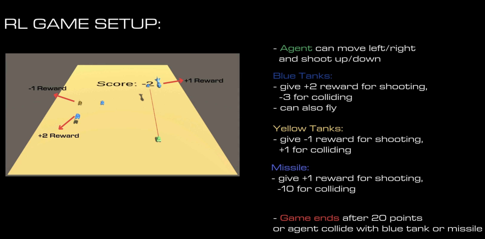
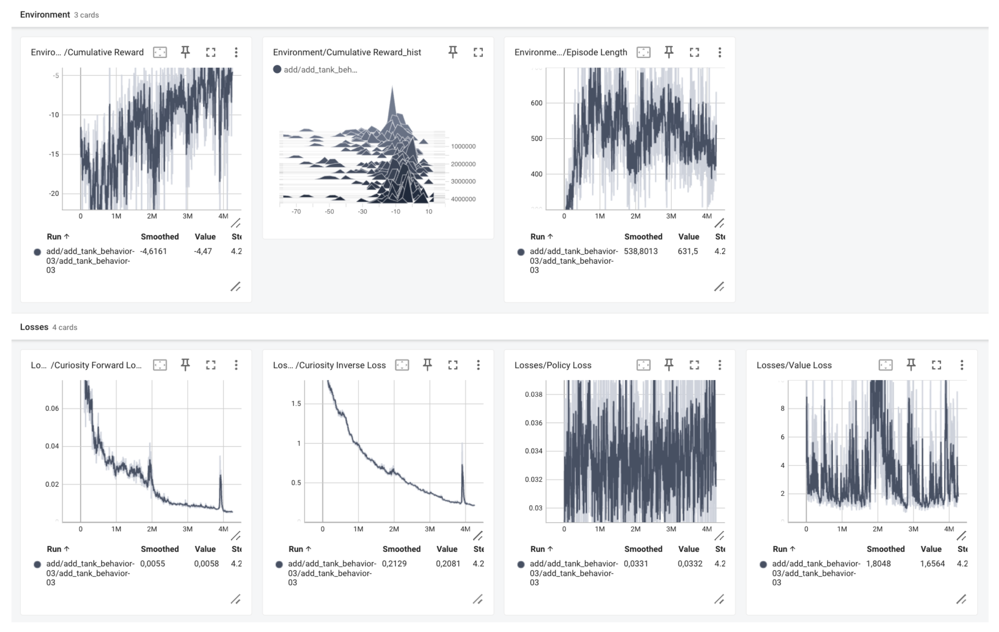
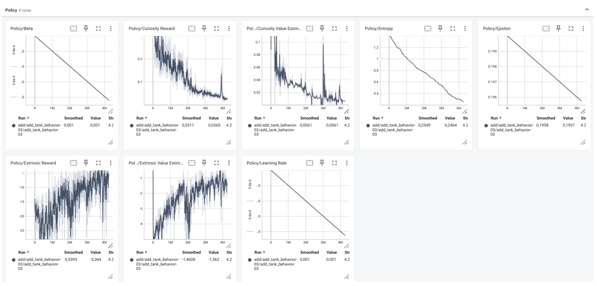
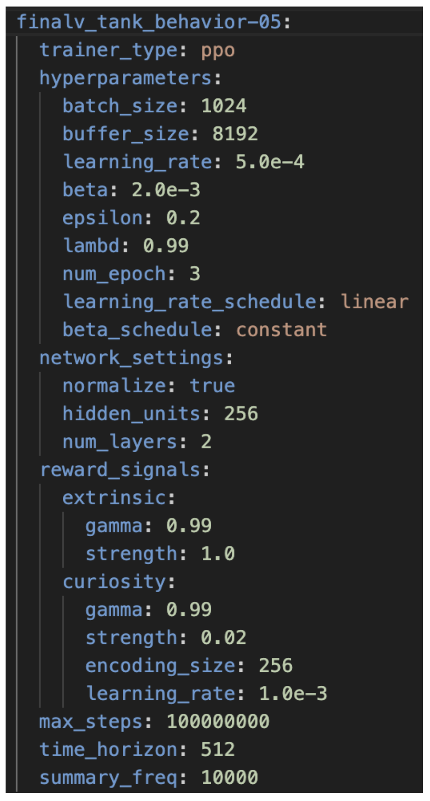
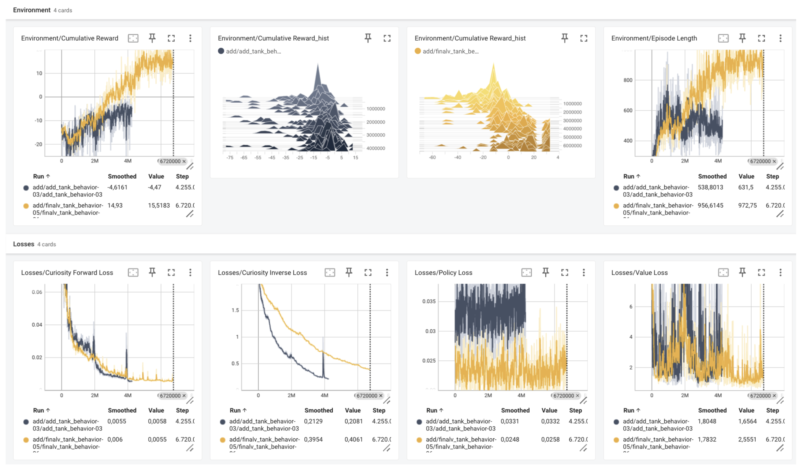
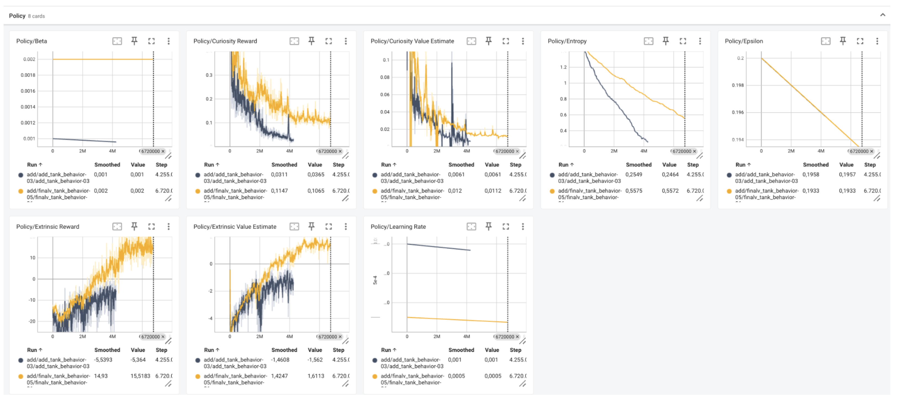

# RL Tank Defense Game
This project was developed by Jeremy Gerster, 14 Dec 2024, as part of the course: *CE6127 Artificial Intelligence in Game Design*, NTU Singapore. The goal was to design a Deep RL tank defense game, analyze training progress, and tune hyperparameters for performance.<br> 
The implementation builds on the course tutorial: https://github.com/sascharo/24s1-ce6127-ml-r21-asgmt

---

## Demo:

https://github.com/user-attachments/assets/fb02d4ab-451a-4c50-ace1-7b3fd8762ba1

---

## Setup
- Open `RLTankDefense` in Unity 2022.3 LTS 
- choose execution mode in Inspector → Tank → Behavior Parameters
  - Default (for training) 
  - Inference Only (needs trained onnx model) 
  - Heuristic Only (lets you control tank yourself)
- Press Play.


### Setup for Training

#### Install PyTorch
```bash
# for macOS
pip install torch torchvision torchaudio
```

#### Install ML-Agents
- Clone (or download and unpack) the latest ML-Agents (>=R21) from:<br> 
https://github.com/Unity-Technologies/ml-agents.git

- In ml-agents-develop run:
```bash
python -m pip install -e ./ml-agents-envs
python -m pip install -e ./ml-agents
```

#### Run training
- choose #parallel training simulations in:<br> 
Inspector → EnemySpawnPointEnv → Simulation Duplicator → Total Simulations

- Run inside RLTankDefense:
    ```bash
    mlagents-learn configs/tank-configs.yaml 
    ```
- Then press play in unity and wait for it to train.


### Parameters and Model
Training parameters: `RLTankDefense/configs/tank-configs.yaml`<br> 
Saved models: `results/…/*.nn`

---

## Game Rules
<p align="center"></p><br>  

The AI tank moves horizontally at the bottom of the field and shoots vertically with raycast.<br>
The goal is to reach 20 points.  

- **Blue tanks (enemies):** +2 reward for shooting, –3 for colliding, can fly.  
- **Yellow tanks (friendlies):** –1 reward for shooting, +1 for colliding.  
- **Missiles:** +1 reward for shooting, –10 for colliding.  
- **Game ends** after at least 20 points or on collision with a blue tank/missile.  

---

## Project Progression
The project was developed in three stages:  

1. **Basic version** – initial setup, Markov Decision Process definition, basic heuristics
2. **Optimized version** – parallel training with multiple environments, hyperparameter tuning
3. **Final version** – vertical shooting, flying enemies, and homing missiles


## Training Progression

The agent was first trained with flying tanks and later extended with homing missiles.  
Initial runs showed unstable learning: cumulative rewards fluctuated around -10, episode lengths varied widely, and policy updates were inconsistent. This indicated difficulties in stable exploration and reward prediction.  

<p align="center">
  
  
</p>

Key adjustments: a slightly lower learning rate, larger batch and buffer sizes, reduced network depth, and higher curiosity strength. Entropy and reward signals were also tuned to encourage exploration and stabilize updates.  

<p align="center"></p>

With these changes, the final version showed higher cumulative rewards, longer and more stable episodes, lower curiosity losses, and reduced policy loss, which enabled the agent to win consistently.  

<p align="center">
  
  
</p>


